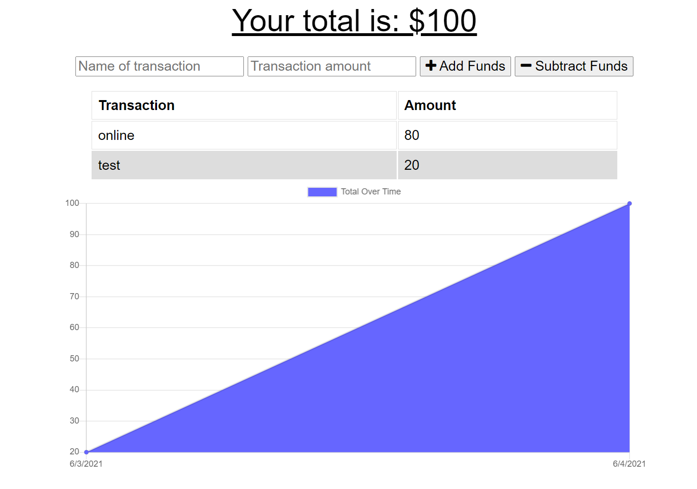

# Plutus

## Description
Online/offline budget-tracking app, great for on the go use!

## Table of Contents
- [Description](description)
- [Installation](Installation)
- [Usage](Usage)

## Installation
You can clone this repo. Then in your terminal, run the command `npm i` to install dependencies. To start the app just run `npm start`, then navigate on a web browser to localhost:3000 and you can run the app locally!

## Usage
Go to the live url, or localhost:3000 if you're using the app locally. You can enter the name of the transaction you want to enter, then the amount of that transaction. then click the add or subtract button to affect the database!

[Live Site](https://radiant-woodland-71854.herokuapp.com/)

